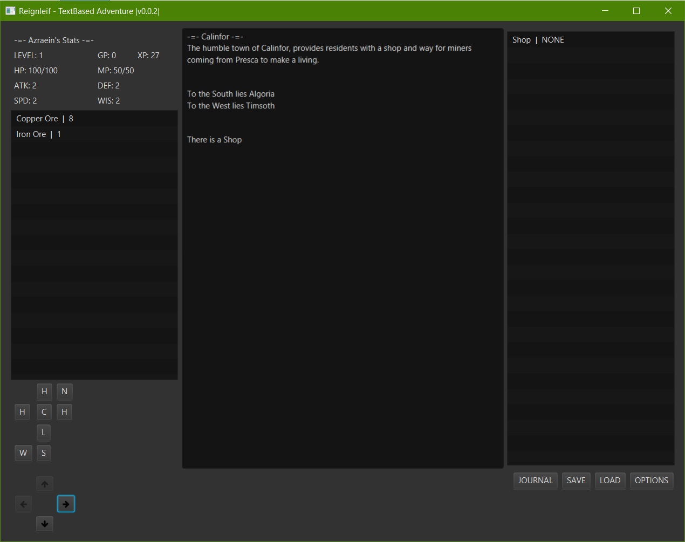

A textbased game engine written in javafx for fun. Probably will never get finished

Using The Following Libraries
=============================

[JavaFX](https://openjfx.io/) - 15

[FontAwesomeFX Commons](https://bitbucket.org/Jerady/fontawesomefx) 9.1.2 | FontAwesome 4.7.0-9.1.2

[DiceNotation](https://github.com/Bernardo-MG/dice-notation-java) - 2.1.2

[GSON](https://github.com/google/gson) - 2.8.7

[LuaJ](https://github.com/luaj/luaj) - 3.0.1

Changelog
=========

- Version 0.0.2

	* Added the basics for buying and selling items
	* Added a Timer for actions
	* Fixed Stats Pane not showing stat updates
	* Working on a whole plethora of new things
	
- Version 0.0.3
	
	* Working on NPCs
	* Refactored most of the WorldRegion into it's own sub regions
	* Working on up towards Crafting
	* Scratchpadding Character Race, Classes, Factions
	* Implemented lootlists (Probably needs to be fixed will figure out later)
	* Working on more Actions (Currently working on smithing, battle action will probably be next once enemies get prototyped)

	
ScreenShots
===========
